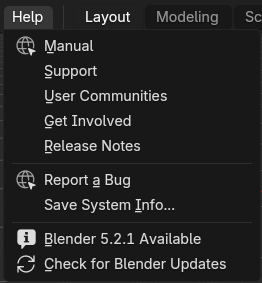

# Blender Update Checker

[](https://github.com/Osmosae/blender-check-for-updates/actions/workflows/ci.yml)

A lightweight Blender extension that checks Blender's official build service and
lets you know when a newer release is available.

It supports Blender 4.2.1 and newer on Windows, macOS, and Linux. The extension
only reports updates—it never downloads, installs, or replaces Blender.

## At a glance

Available releases appear alongside the manual update command in Blender's Help
menu:



The same update can be opened, configured, or dismissed from the status bar:


## Features

- Check manually from **Help → Check for Blender Updates**.
- Optionally check automatically on launch, daily, weekly, or every 30 days.
- Follow the latest stable release, the current major/minor release series, or
  daily development builds.
- Open the appropriate official Blender download page when an update is found.
- Dismiss a status-bar notification for the reported version and restore it
  later from the extension preferences.
- Run network checks in a separate process so Blender's interface remains
  responsive.
- Retry temporary automatic-check failures without displaying disruptive error
  notifications.
- Respect Blender's **Allow Online Access** setting.

Automatic checks are disabled by default.

## Installation

1. Download `blender_update_checker-x.y.z.zip` from the
   [latest release](https://github.com/Osmosae/blender-check-for-updates/releases/latest).
2. Do not extract the ZIP.
3. Drag the ZIP into Blender and confirm the installation, or select
   **Edit → Preferences → Extensions → Install from Disk**.
4. To configure the extension, open Blender's add-on preferences and search for
   **Blender Update Checker**.

## Update channels

| Channel | Checks for |
| --- | --- |
| Latest Stable Release | The newest public Blender release available for your platform and architecture |
| Current Release Series | Corrective releases in the currently installed major/minor series |
| Daily Builds | The newest official development build, including newer builds of the same version |

If the selected channel changes while a check is running, the old result is
discarded and the newly selected channel is checked instead.

## Automatic schedules

- **Every Launch:** checks once, 45–90 seconds after Blender starts.
- **Daily:** checks after 24 hours have elapsed since the last successful check.
- **Weekly:** checks after seven days.
- **Monthly:** checks after 30 days.

Failed automatic checks retry after 15 minutes, then 30 minutes, and then at
most once per hour. Errors and the last-check time remain available in the
extension preferences.

## Platform support

The release is a single platform-independent ZIP containing only Python source
and documentation; it does not require bundled Python wheels. CI builds the
package once on Linux and installs that exact artifact on each tested platform.

| Platform | Blender coverage |
| --- | --- |
| Linux x64 | Declared minimum version and current release |
| macOS ARM64 | Current release |
| Windows x64 | Current release |

## Network and privacy

The extension makes a bounded HTTPS request to Blender's official build listing.
It validates returned download hosts, does not collect telemetry, and does not
send project files or personal data anywhere.

## Development

Run the regular Python tests without Blender:

```console
python -m unittest discover -s tests -p "test_*.py" -v
```

With `blender` available on your path, validate and build the extension:

```console
blender --command extension validate
blender --command extension build
```

The [CI workflow](.github/workflows/ci.yml) also verifies package contents and
runs registration and installed-extension smoke tests in isolated Blender
profiles.

## License

Blender Update Checker is available under the
[GNU General Public License v3.0 or later](LICENSE).
